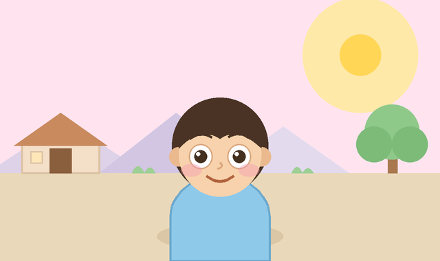
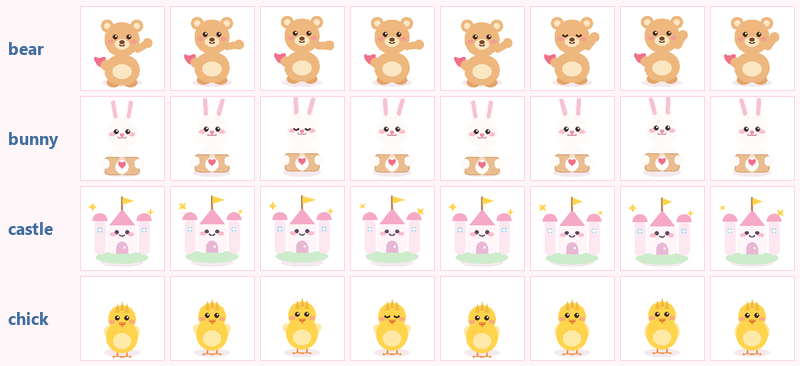
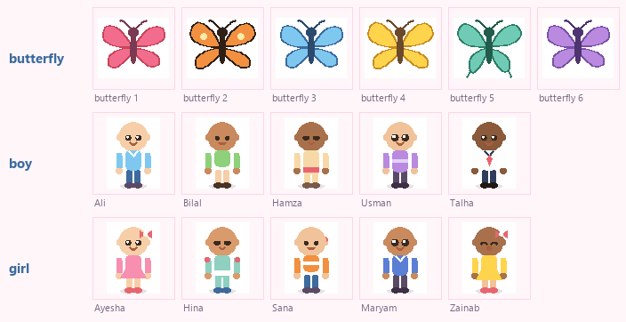

# Iman Donation Trust — review, corrections and advanced-prototype roadmap

Companion to [`iman-donation-trust/index.html`](iman-donation-trust/index.html).
The upstream file is preserved byte-for-byte at [`original/index.html`](original/index.html)
(SHA-1 `66f656da…`, 78,262 bytes — verified against the published GitHub blob) and the
full edit set is in [`index-html.diff`](index-html.diff) (+636 / −109 lines).

---

## 0. TL;DR

* **The companion you asked for is built and working** — an illustrated child in a village
  whose pupils follow the pointer, with a real 3D tilt, three parallax layers, blinks and a
  proximity smile. It is inline SVG, so it needs **no image file, no network and no CSP change**.
  §1 explains why it is a drawing rather than a photo, and gives you a one-line drop-in slot
  if you generate a clip yourself.
* **All four mascots now animate.** The chick (🐥) was the only avatar stuck as a static emoji;
  it is now a baked 8-frame sheet like the bear, bunny and castle — hop cycle, flapping wings
  and a blink frame. §9.
* **Five pages added** (Sites promoted out of its modal, plus Zakat, Donation Guide, Emergency
  and About), and the tab bar went from three tabs to five. §9.
* **A cursor entourage: 6 butterflies, 5 boys and 5 girls** who stay with the pointer for the
  whole session. Sixteen individually specified characters, all generated in code — still no
  image files. The companion's caption bar and pause button were removed at the same time, so
  it simply follows. §10.
* **One hard factual error was found and fixed:** the app shipped Chhipa's helpline as **1121**.
  It is **1020**. 1121 is not a Chhipa number at all.
* **~20 real defects fixed**, including one that could blank the whole page on a device with
  stale `localStorage`, one that leaked ~950 DOM nodes an hour, and one that made every toast
  pile up forever for reduced-motion users.
* **The biggest remaining problem is not code.** The directory implies that charities accept
  almost anything and will collect from your home. Research for this project could not verify
  that for any major Pakistani trust. §3 and §5.2 explain what to do instead.
* §5 is the roadmap: 6 tiers of features, grounded in how giving in Pakistan actually works.
* **I could not run the UI in a browser here** (the sandbox blocks Chrome's named-pipe IPC),
  so verification is: **96 logic assertions** run against the real extracted source, **26 static
  and geometry checks**, a rasterised preview of the companion, and a rasterised contact sheet
  of all four mascots. §7 has the details, including the one thing I could not check.

---

## 1. The companion that looks at your cursor



### What it does

| Behaviour | Detail |
|---|---|
| Pupil tracking | Both pupils follow the pointer, clamped so they never leave the white of the eye |
| 3D tilt | The whole scene rotates in perspective (`rotateY` ±8°, `rotateX` ±5.6°), smoothed with a lerp — no CSS transition, which would fight the frame loop |
| Parallax | Three depth layers (sky/hills, village, child) slide against each other, so the scene reads as having depth |
| Blink | Tweened by hand in the frame loop, not by CSS, because CSS transforms on SVG children are still unreliable on the cheap Android builds this app targets |
| Proximity | The smile widens and the blush deepens as the pointer gets close |
| Idle | After 4 s without input the child looks around on its own instead of freezing |
| Touch | `pointerdown`/`pointermove` work on a phone; tap the scene and it looks at your finger |
| Off switch | A visible **"Following ✓ / Paused"** toggle, remembered in `localStorage` |
| Reduced motion | `prefers-reduced-motion` disables tracking entirely and disables the toggle with the label "Motion reduced" |
| Cost control | The rAF loop stops when the scene scrolls off-screen (`IntersectionObserver`), when the tab is hidden, or when paused. Transforms only — no layout, no paint of anything but the composited layer |

### Why it is a drawing, not a photograph

Two separate reasons, and I want to be straight about both:

1. **Practical.** I have no image- or video-generation tool in this environment, and the
   sandbox blocks outbound binary downloads, so I could not produce or fetch an asset for you.
2. **Better anyway.** Putting a real, identifiable child's face — or a photoreal AI-generated
   "poor child" — next to a donate button is a specific ethical choice, not a neutral one.
   It trades on a real person's dignity to move a donor, and with a generated image it also
   risks being untrue. An illustrated companion gets you the whole interaction (attention,
   warmth, the "it noticed me" moment) without either problem. The caption says so out loud,
   which is itself a trust signal.

If you do use a real child's image or a generated one, label it as an illustration/AI
generation, and get written permission plus a release from a parent or guardian.

### Swapping in your own clip (image-to-video route)

The code already supports it. There is a `CONFIG.child` block at the top of the script:

```js
child: {
  mode: 'vector',   // 'vector' (built-in drawing) | 'video' (your clip) | 'off'
  videoSrc: '',     // e.g. 'media/child.mp4'
  poster: ''        // e.g. 'media/child-poster.jpg'
}
```

1. Generate your clip with any image-to-video tool you like (search "free image to video" —
   the well-known ones all have a free tier). **Check the licence for commercial/charity use**
   and whether the output is watermarked; free tiers often restrict both.
2. Export **muted, looping, ~16:10**, ideally under ~1.5 MB, and drop it next to `index.html`
   (e.g. `media/child.mp4`) with a `.jpg` poster frame.
3. Set `mode: 'video'` and fill in the two paths.

Two things to know:

* **No CSP change is needed for a same-origin file.** The policy already grants
  `media-src 'self'`. Only an external URL (a CDN, YouTube) would need the policy relaxed —
  and I would not relax it.
* In video mode the 3D tilt, parallax and the proximity reaction still apply to the clip, but
  the eyes cannot be re-aimed — a video is pixels. So **the clip itself must contain the
  eye movement.** That is exactly what an image-to-video tool gives you, which is why this
  combination works well. The caption already adapts.

To ask for the best of both, generate an *animated illustration* rather than a photoreal
child, and keep the pupils as a separate overlay if you want live tracking.

---

## 2. Mistakes that were actually wrong (now fixed)

### Blocking / high

| # | Defect | Why it mattered |
|---|---|---|
| 1 | **Chhipa's helpline was 1121.** It is **1020** | A wrong emergency number in a national directory. Confirmed against Chhipa's own site and the Government of Sindh's Commissioner Karachi emergency-services table. Four of five helplines now carry a `src` link and a "checked on" date, so this cannot rot silently again |
| 2 | **A corrupt `localStorage` value blanked the page** | `Object.assign({…}, store())` trusted whatever was there. `{profile:null}` threw during init, so the visitor got a white screen with no way to recover. State is now repaired shape-by-shape (`sanitise()`), and unreadable JSON is copied to a `.bak` key before anything overwrites it |
| 3 | **`history.replaceState` was unguarded** | It throws `SecurityError` on a `file://` document, and `route()` runs at init *and* on every navigation — so opening the file directly broke the whole router. Now wrapped |
| 4 | **The header overflowed and was clipped at 360–414 px** | The mascots were shrunk with a CSS `transform`, which does not shrink the layout box, so the row needed ~390 px in a ~340 px space and `overflow:hidden` cut it off. Sizes are now real layout sizes chosen from the viewport |
| 5 | **Every toast stacked forever under `prefers-reduced-motion`** | The global `animation:none` rule meant `animationend` never fired, and that was the *only* removal path. Removal is now a timeout, with the animation event only as a fast path |
| 6 | **~950 orphan DOM nodes per hour** | Floating hearts were appended to `#welcome-card` every 3.8 s and removed on `animationend` — but animations never run in a `display:none` subtree, and `#welcome-card` is inside the hidden Home view whenever you are on another tab. Now skipped when Home is inactive, with a timed removal as backstop |
| 7 | **A finished ticket stayed on screen after the basket changed** | Add an item after submitting and the *old* ticket sat directly above the new basket — a donor could show the wrong ticket at a site. Adding to the basket now hides it |
| 8 | **"Save ticket" / "Export" could silently do nothing** | `a.click()` then `URL.revokeObjectURL()` in the same tick cancels the download in Safari and Firefox; the anchor was never in the DOM (Firefox needs it); and iOS ignores `download` on blob URLs while the toast still claimed success. All three fixed, and the toast is now honest about the iOS case |
| 9 | **Unsaved data was silent** | `persist()` swallowed every exception, so a donor on a full or blocked store got no warning that nothing was being saved. It now says so once |
| 10 | **Unescaped storage-derived values reached `innerHTML`** | `rec.date` and `rec.status` bypassed `esc()`. There is no reflected XSS today (name/phone/notes all reach the DOM safely), but `localStorage` on `*.github.io` is writable by every other project page under that account, so it is a real sink. Escaped, and `qty` is coerced through `Number()` |
| 11 | **Validation errors were invisible to assistive tech** | Errors were conveyed by a red border and a `display:none` paragraph, with no `aria-invalid` and no `aria-describedby`. Now wired, `required` added, and focus moves to the first invalid field |
| 12 | **The date picker offered yesterday** | `new Date().toISOString()` is UTC; before 05:00 in Pakistan that is the previous day. Now a local-date helper, with the `min` re-checked on submit |
| 13 | **The route/`#sites` hash was dead code** | A `#sites` bookmark silently opened Home, because `route()` rewrote the hash before the `hashchange` handler could see it. Removed |
| 14 | **Clicking a site reset your city choice** | Re-entering Donate rebuilt the `<select>` and wiped the selection. Both city and chosen branch are now remembered |
| 15 | **Sites were keyed by display name** | The ticket resolved a site with `SITES.find(s => s.name === rec.site)`. Two branches sharing a name would break it. Options now carry `site.id`, with a name-based fallback so tickets saved by v1–v3 still resolve |

### Medium

| # | Defect | Fix |
|---|---|---|
| 16 | `#cat-grid` was `role="list"` while each card was a `<button role="listitem">` — which **strips the button announcement** from screen readers | Roles removed; the grid is a plain `role="group"` of buttons |
| 17 | Search was inconsistent: categories matched the whole query as one substring ("kids items" matched nothing) while sites used word-AND | All three paths now use the same word-wise AND |
| 18 | The suggestion toast read as "your nearest site" but measured from the **trust's** Gujranwala HQ, so a Karachi donor was pointed at Gujranwala on every single item added | Reworded to name what it measures, and it now fires once per basket instead of once per tap |
| 19 | `celebrate()` was re-entrant: two fast submissions started two rAF loops clearing each other's particles | Cancellable handle |
| 20 | The sprite loop ran for the entire session, backgrounded tab included | Pauses on `document.hidden` and resumes on visibility change |
| 21 | `fallbackCopy` announced "Copied!" when `execCommand` returned `false` | Return value is checked; the textarea is off-screen, readonly, focused |
| 22 | Basket +/− re-rendered the list and **dropped keyboard focus to `<body>`** every press; delete used a captured index | Focus is restored to the equivalent button; delete filters by identity |
| 23 | "Less" / "More" / "Remove" repeated identically on every row | Labels now name the item and condition ("One more Books", "Remove Books (Good)") |
| 24 | "Clear everything" left `state.ui` (city, gaze) behind, and left the form and ticket on screen | Resets from the defaults and re-renders |
| 25 | The donation form silently overwrote a nickname chosen in Profile | Only fills the name if it is empty |
| 26 | The bunny mascot routed to Donate but was `aria-hidden` — a real action, mouse-only | It is a real `<button>` with a label now; the decorative mascots stay hidden |
| 27 | Avatar selection was visual-only; `#av-stage` was a `cursor:pointer` div with no handler at all | `aria-pressed` on the picker; the dead affordance is `aria-hidden` |
| 28 | `/` moved focus to the search box **while a dialog was open** (the tagName guard passed because focus sits on the panel `<div>`) | Bails out when a modal is open |
| 29 | `prefers-reduced-motion` killed animations but left `scroll-behavior:smooth` and five smooth `scrollTo` calls | All routed through a reduced-motion-aware helper |
| 30 | Safe-area insets were ignored, so the fixed nav sat under the iPhone home indicator (`viewport-fit=cover` was already set) | `env(safe-area-inset-bottom)` applied to the nav and footer |

### Copy and structure

* `og:description` claimed **"34 cities"**; the data is **34 sites in 17 cities**. Corrected, and
  "All of Pakistan" in the directory heading became "Pakistan".
* The ticket footer promised **"call ahead to arrange pickup"**. Given the research (see §5.2)
  that a charity may not offer, this became "call ahead to confirm what they can accept".
* The form now states plainly that **nothing is uploaded** and where the data lives, because
  it collects a name and phone number.
* `<meta name="format-detection" content="telephone=no">` — iOS was auto-linking the numbers
  *inside* the ticket `<pre>`, breaking its layout and double-linking the app's own buttons.
* A `<noscript>` block now offers the three national helplines as tappable links instead of
  showing an empty shell.

### The three files the `<head>` referenced but that did not exist

`og-cover.png` (1200×630), `apple-touch-icon.png`, `icon-192/512.png` and `manifest.json` are
now generated. **All artwork is drawn from code** by
[`tools/make_assets.py`](tools/make_assets.py) (a parametric heart curve), so the repo carries
no third-party art and nothing is licensed in.

Two deliberate choices:

* The manifest is **`manifest.json`, not `manifest.webmanifest`** — GitHub Pages serves
  `.webmanifest` as `application/octet-stream`, and Chrome then refuses the manifest outright.
* There is **no service worker yet**, so Chrome will not offer the install prompt. Adding one
  is the single highest-value remaining feature (§5.4) — but it needs a cache-invalidation
  strategy that I could not test here, and a stale cache on a donations app is worse than no
  cache.

---

## 3. What is still wrong (and why I did not just fix it)

| Issue | Why it is still there |
|---|---|
| **The directory's core promise is probably overstated.** Every site is listed as accepting goods and the flow implies drop-off/pickup. Research could verify a genuine *goods* intake pathway for only four organisations (Saylani — used medical equipment; Alamgir — medicines, books, clothing; Dar-ul-Sukun; Indus). **No major trust was found that publicly commits to collecting used clothing/books/toys from a donor's home.** | This is a data and product decision, not a code change. I added a warning to the directory ("not individually verified… treat 'accepts everything' as a prompt to ask, not a promise") but the honest fix is a per-site evidence model — §5.1 |
| **PII persistence on a shared origin.** On GitHub Pages the origin `iman-coll.github.io` is shared by every project page under that account, so another page there can read this donor's name and phone. The app now *says* where the data lives, but still stores the phone number. | Dropping the number changes a feature you may want (repeat tickets). It is a one-line change — say the word and I will make phone storage opt-in |
| **Contrast.** White on the `.btn-primary` gradient measures ≈2.8–3.6:1 against a 4.5:1 requirement; several greys (`#a08aa8`, `#9a8aa2`, `#8a7a93`) and the placeholder are 2.1–4.0:1. | These are your colours and your look. The safe fixes are to darken the CTA gradient to roughly `#c9455a → #a83449` and the greys to `≥4.5:1`. I did not want to repaint your design without asking |
| **Touch targets.** `.del` is ~19 px and the quick-add chips ~22 px, below the 24 px minimum. | Cosmetic risk of changing chip density; trivial to fix if you want it |
| **One avatar/`#pf-name` detail:** `persist()` still runs on every keystroke (full `JSON.stringify` of up to 200 records, including during IME composition). | Needs a debounce; low impact at realistic history sizes |
| **Sites modal resets its filters on each open**, and the "Showing results for…" line goes stale when you change the province/city selects. | Needs the filter state moved into `state.ui` plus a search input inside the modal — a small feature, listed in §5.1 |
| **Google Fonts load from `fonts.googleapis.com`** while the page advertises "no network", and offline falls back to Comic Sans MS. | Self-hosting two woff2 files is the fix; it needs the binary assets, which I cannot fetch here (§5.4) |
| **`.streamlit/` and `app.py` in the same Pages repo.** A root `.py` is served as public plain text, and `.streamlit/config.toml` becomes downloadable the moment anyone adds `.nojekyll`. The Streamlit variant also duplicates `SITES`/`HELPLINES`/`CATEGORIES` and cannot share them while `connect-src 'none'` holds. | Structural decision for you: keep the Streamlit app in a separate repo or a subfolder that is excluded from Pages |
| **No `LICENSE`, no disclaimer of affiliation, no privacy policy.** Given the page is branded "Iman Donation Trust" and republishes Edhi/Saylani/Chhipa/Al-Khidmat/Shaukat Khanum names, addresses and numbers, a "not affiliated with, and not endorsed by, any listed organisation" line is worth adding. | Needs your decision on the licence and the trust's own registration details |

---

## 4. Side-by-side, before → after

| | Before | After |
|---|---|---|
| Lines | 1,137 | 2,372 |
| Pages | 3 (Home, Donate, Profile) | 8 (Home, Sites, Donate, Zakat, Profile, Guide, Emergency, About) |
| Animated mascots | 3 of 4 (chick was a static emoji) | 4 of 4 |
| Companion | none | inline SVG, cursor-tracking, no caption, no pause control |
| Cursor entourage | none | 6 butterflies + 5 boys + 5 girls, generated in code |
| Assets referenced | 3 that 404 | all generated, all present |
| Helpline accuracy | 2 of 3 correct | 4 of 5 carry a source link + checked date |
| Money handling | — | a Zakat calculator that never stores or sends the figures |
| State loading | trusted | repaired field by field, corrupt blob backed up |
| Reduced motion | animations off, but scroll and tracking still on | fully honoured |
| Form errors | colour only | `aria-invalid` + `aria-describedby` + focus management |
| Verification | none | 128 logic assertions + 26 static/geometry checks |

---

## 5. Roadmap: making it a genuinely advanced Pakistan donation prototype

Ordered by value-per-effort, and grounded in the domain research in
[`research/pakistan-donation-briefing.md`](research/pakistan-donation-briefing.md). Every claim
below is tagged the way that file tags it; treat anything marked *unverified* as unverified.

### 5.1 Tier 1 — Evidence and trust (do this first)

The differentiator is not the UI, it is **whether a donor can believe the directory**.

* **Replace the implicit "accepts everything" with an evidence model.** Give every site
  `accepts[]`, `intake: 'drop-off' | 'pickup' | 'courier' | 'unknown'`, `source_url`, `checked_on`.
  Render the evidence, not a green tick: *"Clothing — published on chhipa.org, checked
  2026-10-07"* versus *"Not documented — call to confirm"*. Design rule: **"unverified" must
  not read as "bad"**, because many genuine small organisations are not PCP-certified.
* **Show staleness.** A 2019 evaluation is not 2026 assurance; display the date next to the claim.
* **Tap into the free public registers.** The PCP NPO Directory (`pcp.org.pk/npo-directory`)
  shows PCP evaluation years per organisation; the Sindh Charity Commission publishes a public
  charity search *and* a proscribed-organisations list; Punjab and KP run their own commissions.
  A monthly manual cross-check against those lists is a realistic, high-value chore.
* **Add an impersonation warning.** Edhi's own homepage runs a permanent scam alert naming four
  look-alike domains (`edhius.com`, `.us.com`, `.net`, `.org`). A "how to spot a fake appeal"
  card costs nothing and is exactly what a directory app should own.
* **Move the city/site filter state into `state.ui`** and add a search box inside the Sites
  modal (today you must type on Home first and press Enter, which does not exist on a phone).

### 5.2 Tier 2 — Model in-kind donation the way it actually works

* **Condition grading with the charity's own language.** You already have Like New/Good/Usable/
  Needs Repair. Add the "we cannot take this" path — soiled or unusable clothing, medical waste,
  broken electronics — and say so *before* the donor carries a bag across the city. Build the
  list from each organisation's published guidelines once you have them (Goonj's published
  material guidelines in India are a good structural model).
* **Drop-off as the default, pickup as the documented exception.** `Chhipa`'s "You Call We
  Collect" is real but never specifies goods; Al-Khidmat's doorstep service is explicitly
  **cheques only**. So a pickup flow should only appear where the charity has published one,
  and the ticket should say "confirmed with the site on <date>" when it has.
* **Doorstep hand-off via a courier.** Goonj's Pakistani translation — donor books a Bykea /
  TCS / Leopards consignment to the charity's verified address — is probably the single most
  transferable mechanic for donors who cannot travel. It needs no integration at first: the
  ticket already carries the address.
* **Qurbani hides (chamra)** are a real, differentiated feature *and* a trap. PTA data via
  Arab News: ~7.5 m hides worth ~Rs 8.7 bn; average cow hide ~Rs 2,000, goat skin ~Rs 600.
  But Al-Khidmat says hides are "no longer a primary source of funding" and that "strict
  government regulations have also barred smaller organizations from collecting skins", and
  spoilage is the core failure mode (Eid in peak summer, no centralised cold chain, unsalted
  hides rot). So: route donors to **large registered collectors**, and teach salting + speed.
  Do not model it as an open flow.
* **Ration bags as a bill of materials.** Donors think in bags, not rupees-per-meal:
  wheat 50 kg, rice 25 kg, sugar 50 kg, oil 16 L, blankets. A "build a rashan bag" screen
  matches how people actually give.

### 5.3 Tier 3 — Islamic giving, and a Hijri-aware year

* **Separate the categories properly**: Zakat, Sadaqah, Sadaqah Jariyah, Fitrana, Fidya,
  Kaffara, Aqiqah, Qurbani, Kafalat (orphan sponsorship), Sehri/Iftar, Langar.
  Chhipa publishes concrete bands (Fitrana wheat Rs 300 → Ajwa Rs 10,000; Fidya Rs 400/fast,
  Rs 12,000 for 30; Iftar box Rs 200; Ramadan ration package Rs 5,000/family; Kafalat
  Rs 10,000/month) — but **those are Chhipa's rates, not a national standard**, so each rate
  needs `as published on <date>` and a source.
* **A seasonal mode driven by the Hijri calendar.** Ramadan dominates every organisation's
  front page; Eid-ul-Adha drives Qurbani; winter drives blanket appeals; the monsoon drives
  flood appeals. A single "what season is it" switch changes the home screen, the default
  category and the copy. This is the highest-delight, lowest-risk feature on this list.
* Note: no organisation was found publishing an **itikaf** donation product — treat that as
  unverified rather than inventing it.

### 5.4 Tier 4 — Actually usable on a Pakistani phone

The numbers (DataReportal Digital 2025): 253 m people, 116 m internet users (**45.7%**),
**~137 m offline**, median age 20.6, **61.4% rural**. Only ~29.6% of social identities are female.

* **Offline-first.** A service worker that caches the shell + the site directory is the single
  highest-leverage feature. A donor on a patchy 3G connection at a drop-off point should still
  be able to open the ticket. Do it with a version-stamped cache and an explicit "you are
  offline, showing cached data from <date>" banner.
* **Self-host the two fonts** (or drop them for a system stack). Two woff2 files with
  `font-src 'self'` removes a Google dependency, makes the "nothing is uploaded" claim strictly
  true, and stops the offline fallback to Comic Sans MS.
* **Urdu and RTL.** Add `dir="rtl"` support with Urdu strings, using the **system Urdu font**
  by default — a Nastaliq webfont is a real bandwidth cost on metered low-end Android. Phone
  numbers must stay LTR inside RTL text (isolate them).
* **Roman Urdu copy options.** Most of the target audience reads Roman Urdu more comfortably
  than formal English. Keep both registers.
* **WhatsApp-first sharing** (`wa.me`) and `tel:` links are the primary CTAs in Pakistani
  practice — Al-Khidmat itself uses `wa.me` for donation slips. A "share this appeal" button
  belongs above the fold.
* Keep deep links keyless: `google.com/maps/search/?api=1&query=…` needs no API key or billing,
  which matters for a student prototype. Store lat/lng for offline map fallback; do not pull in
  the Maps JS SDK.

### 5.5 Tier 5 — Emergency mode

NDMA publishes sitreps as PDFs, but **ReliefWeb** mirrors the same figures as HTML, which is
developer-friendly. Verified 2025 monsoon figures: 1,037 deaths (Punjab 304, KP 504), ~80,000
displaced, ~4.9 m affected in Punjab, 229,760 houses destroyed or damaged, 1.12 m ha inundated,
>22,800 livestock lost, Rs 822 bn (~US$3 bn) damage. *(The 2022 flood figures the app currently
gestures at could not be verified from a primary source — do not print a 2022 number until it is.)*

* An **emergency banner** that names the affected districts, the verified organisations running
  appeals, and — critically — the places **not** to send money. Fake flood appeals are the
  single most common donation scam in Pakistan.
* Keep it a **static, dated** snapshot with a source link. Live data means a backend, and a
  backend means the "nothing is uploaded" promise dies.

### 5.6 What *not* to build

* **Do not collect money.** This is the most important item in the whole report. SBP **BPRD
  Circular Letter No. 04 of 2012** states flatly that *"Personal accounts shall not be allowed
  to be used for charity purposes/collection of donations"*, requires enhanced due diligence
  and senior-management approval to open an NPO account, and requires that an advertised
  donation account title **match the soliciting entity** — otherwise the bank caution-marks the
  account and may file a Suspicious Transaction Report. Provincial law regulates fundraising
  itself (the Sindh Charities Act 2019 covers "fund-raising and collection and utilization of
  charitable funds"). **Deep-link out to each verified charity's own rails and never hold
  funds.** Saying so explicitly on the site is a trust *feature*, not a limitation.
* **Do not add GPS or accounts.** The current "no GPS, no permission prompts, nothing tracked"
  stance is a genuine advantage. Asking for location would cost more trust than it buys.
* **Do not print a tax percentage.** Sources conflict: one secondary source says a 30%
  (individuals) / 20% (companies) cap, another says 30% for both, and KPMG's 2021 brief reports
  that clause (61) of Part I of the Second Schedule was **withdrawn** by the Tax Laws (Second
  Amendment) Ordinance 2021. What is defensible: it is a **credit** at roughly the donor's
  average rate, **only** for FBR-approved institutions, and a bank trail or crossed cheque is
  materially safer than cash. PCP's own Section 61 and Section 100C one-pagers are the primary
  documents to read next — they are PDFs and were not readable during this research.
  The ticket should keep saying: *"donor record produced by this app — not an FBR-approved tax
  receipt, confers no tax benefit."*

---

## 6. Legal and ethical cautions

Not legal advice, and much of this is **unverified**.

* A real trust in Pakistan needs a registration route — Societies Registration Act 1860,
  Trust Act 1882, SECP section 42, or provincial charity commissions — plus, for tax-exempt
  status, FBR approval under **section 2(36)** of the Income Tax Ordinance 2001 with PCP
  evaluation on FBR's behalf. A hobby prototype that only *points at* registered organisations
  is in a very different position from one that solicits funds.
* The three provincial charity commissions (Sindh, Punjab, KP) run public registers and
  proscribed-organisation lists. Cross-checking the directory against them is cheap and
  materially reduces the chance of listing a banned outfit.
* **Affiliation.** The page is branded "Iman Donation Trust" while listing other trusts'
  details. Add a clear, unmissable line that it is an independent directory, not affiliated
  with or endorsed by any listed organisation.
* **Data.** A privacy note is now in the UI, but a proper privacy policy is still needed for a
  form that collects a name and phone number — and reducing what is stored is better than
  documenting what is stored.

---

## 7. How this was verified — and what was not

| Check | Where | Result |
|---|---|---|
| Byte-exact upstream snapshot | `original/index.html` | SHA-1 `66f656daab70a197e312f2bc60ecc1dd088e90d8` matches the published GitHub blob |
| JS parses | `tools/check.py` | `node --check` on the real script block |
| DOM integrity | `tools/check.py` | 87 ids, all unique; all 70 `$('#…')` references resolve; all `aria-labelledby` / `label[for]` targets exist |
| Referenced files exist | `tools/check.py` | manifest, icons and `og:cover.png` all present; `og:image` names a real file |
| CSP compliance | `tools/check.py` | every external resource is allowed by the policy; no `fetch`/XHR/WebSocket anywhere |
| Companion SVG geometry | `tools/check.py` | 2 eyes / 2 clips / 2 lids / 2 pupils; each lid starts at its own eye's top and matches its clip exactly; `LID_H` fully closes the eye; the pupil cannot escape the white; the far layer overhangs enough to cover its own parallax travel; 16 child shapes sit inside the 400×… viewBox |
| Logic | `tools/run_logic_tests.py` | **128/128** assertions, run in Node against the *real source extracted from `index.html`* (constants, utils, `sanitise`, `searchSites`, `ticketText`, the phone-validation block, the Zakat maths and the 16 entourage specs are sliced out by name, so the tests cannot drift from the shipped code) |
| Companion composition | `tools/preview_companion.py` | The SVG is redrawn from its real coordinates with Pillow so a human can see it — see the image at the top. This is an approximation of the renderer, not a reference renderer |
| **Mascot sheets** | `tools/preview_sprites.py` | A Canvas2D shim runs the real `drawBear`/`drawBunny`/`drawCastle`/**`drawChick`** in Node, records the flattened paths, and rasterises all 8 frames of each into a contact sheet — see §9 |
| **Cursor entourage** | `tools/preview_friends.py` | Runs the real `butterflySVG()`/`figureSVG()` in Node, parses all 16 results with lxml (**16/16 well-formed**) and rasterises them through `tools/svgrender.py` — see §10 |
| **The UI in a real browser** | `tools/selftest.js` | **Not executed.** Headless Chrome and Edge both fail here: the sandbox denies them the named-pipe IPC their multi-process architecture requires (`FATAL: platform_channel.cc: Check failed: Access is denied`). A 61-assertion browser suite is included for you to run yourself |

To run the browser suite:

```powershell
python tools/make_selftest.py           # writes tools/site/index.html + selftest.js
python -m http.server 8123 --directory tools/site
# then open http://127.0.0.1:8123/ and read the <pre id="RESULTS"> block at the bottom
```

**What that gap means:** the logic is well covered, but the *visual* result in a real browser —
fonts, the 3D transform actually looking right in motion, the header at exactly 360 px — is
reasoned about and statically checked, not observed. Please open it on a phone before you demo it.

---

## 8. Sources

Everything above is drawn from the domain briefing and the QA review. The primary links:

* [Edhi Foundation](https://www.edhi.org) — Emergency Call 115, and the live impersonation/scam alert
* [Chhipa Welfare Association](https://www.chhipa.org) — **helpline 1020**; ["You Call We Collect"](https://www.chhipa.org/how-to-donate/you-call-we-collect/); published Fitrana/Fidya/ration rates via [Donate via Courier](https://www.chhipa.org/how-to-donate/donate-via-courier/)
* [Commissioner Karachi — Emergency Services](https://commissionerkarachi.gos.pk/emergency-services) — the official table listing Chhipa as 1020
* [Saylani Welfare](https://saylaniwelfare.com) — UAN 111-729-526; [accepts donated used medical equipment](https://saylaniwelfare.com/services/health/medical-equipment)
* [Al-Khidmat Foundation](https://alkhidmat.org) — UAN 0800 44448; [Qurbani](https://alkhidmat.org/donations/islamic-giving/qurbani) (doorstep collection is **cheques only**)
* [Sindh Charity Commission](https://charitycommission.sindh.gov.pk/) — Sindh Charities Act 2019, public charity search, proscribed organisations
* [PCP NPO Directory](https://pcp.org.pk/npo-directory) — FBR's designated certification agency; PCP evaluation years per organisation
* SBP **BPRD Circular Letter No. 04 of 2012** — personal accounts may not be used to collect donations
* Regional structural model: **Goonj** (India) — collecting centres, published material guidelines, and "send material via a delivery app"
* Data: DataReportal *Digital 2025: Pakistan* (connectivity, gender split); PBS Census 2023 (population)

Full detail, with per-claim `[fetched]` / `[snippet]` / **UNVERIFIED** / **CONFLICT** labels and a
much longer source list, is in [`research/pakistan-donation-briefing.md`](research/pakistan-donation-briefing.md).

---

## 9. Round 2 — the chick mascot, and five new pages

### 9.1 The chick is now a real animation



The chick was the odd one out: `sheet:null`, so `setAvatar` fell back to a static 🐥 emoji while
the bear, bunny and castle hopped and blinked. It now has a baked 8-frame sheet, `drawChick()`,
built to the same contract as the other three: a hop driven by `|sin(T·2π)|`, a counter-sway on
the wings, one blink frame (frame 3), and a ground shadow that stays put while the body lifts.

Small details that make it read as a chick rather than a yellow ball: a three-feather tuft drawn
*after* the head fill, the beak split by a darker line, feet drawn **before** the body so the toes
just clear it, and wings drawn before the body so only their outer half shows.

Two things worth knowing about how this was verified, because I could not run a browser:

* `tools/preview_sprites.py` runs the **real** drawing functions in Node against a Canvas2D shim
  that flattens curves, rectangles and rounded rectangles into paths, then rasterises them with
  Pillow. The contact sheet above is that output. It is an approximation of canvas, not a
  reference renderer — but it is enough to confirm the chick has a face, blinks on the right
  frame, and animates in step with the others.
* The avatar id stays `duck` while the sheet key is `chick`. Renaming the id would have
  invalidated every profile saved by an earlier version (the state repair would quietly reset
  them to the bear). A static check now enforces that every avatar points at a sheet that
  actually exists and whose draw function is defined, so this cannot silently regress again.

### 9.2 Five new pages

| Page | Why it exists |
|---|---|
| **Sites** (was a modal) | On a phone the modal was a small scroll box with its own keyboard and no room for the disclaimer. It is a full page now with its own search box, province/city filters, a live result count, and a proper empty state. It also fixes a latent bug: city headers were derived from a "last city" variable, so the first `SITES` entry added out of city order would have produced a duplicate header. Grouping now goes through a `Map`. |
| **Zakat** | The single most useful tool this app could have for a Pakistani audience. Cash, gold, silver, business stock, money owed to you, minus debts you must pay; compares against the nisaab; shows 2.5% of the total. A helper derives the nisaab from the classical 87.48 g gold / 612.36 g silver measures × a rate **you** type in, because the app makes no network requests and a stale metal price would be worse than none. |
| **Donation Guide** | Answers the question the directory cannot: *what should I actually put in the bag?* Before you give, what travels well, **what charities usually cannot take** (soiled clothing, used underwear, loose medicines, medical waste, broken electronics), the four condition grades explained, how drop-off works, and the courier option for donors who cannot travel. |
| **Emergency** | A dated, static snapshot of the last verified monsoon season (NDMA figures via ReliefWeb, checked 2026-10-07) with the six headline numbers, the verified relief organisations, and — the actually valuable part — **how to spot a fake appeal**: a personal account number, a look-alike domain, urgency plus a deadline, chain-message forwards. Plus the two public registers where you can check an organisation yourself. |
| **About & Trust** | The credibility page a directory like this needs: it is independent and **not affiliated with or endorsed by** any listed organisation; it never collects money; how the directory was compiled and where it is weak; that "not PCP-certified" does not mean "not real"; what the data export contains; and where to report a wrong number. |

The tab bar went from three tabs to five (Home · Sites · Donate · Zakat · Profile). Guide,
Emergency and About are reached from the Home quick-link cards and the footer, and they keep the
Home tab lit so the nav never goes blank — a static check enforces that every route either has
its own tab or a declared parent.

**On the Zakat calculator specifically:** it is deliberately **not persisted**. A name and phone
number are already stored, but financial figures have no reason to outlive the tab, and the page
says so out loud. One assertion in the logic suite enforces it — it fills in a figure, calls
`persist()`, and fails if that figure appears anywhere in `localStorage`. The page also states
plainly that it is a calculator, not a fatwa, that zakat requires the hawl (one lunar year) and
being above the nisaab, and that zakat may only go to the eight eligible categories.

### 9.3 What the new tests caught

Writing the Zakat tests found a real bug in code I had just written: `zkNum()` stripped every
non-digit character **including the minus sign**, so typing `-5000` was parsed as `+5000` and
silently *inflated* the total. It now keeps the sign so a negative parses as negative and is then
rejected. That single assertion (`zakat: a negative entry is treated as zero`) is the clearest
argument for testing money maths rather than eyeballing it.

### 9.4 Still not verified

Everything in §7 applies here too, and it applies hardest to the new pages: the Zakat calculator's
*live* behaviour (does it feel responsive as you type), the Guide's long definition lists on a
360 px screen, and the five-tab bar's spacing are all reasoned about, statically checked, and
logically tested — but not observed. `tools/selftest.js` now covers all of it, including the
calculator's live recompute and the nisaab helper, and it still has not been executed here.
**Please open it on a phone before you demo it.**

---

## 10. Round 3 — no caption, no pause, and an entourage

### 10.1 The removals

The companion's caption bar and its "Following ✓ / Paused" button are gone. There is now no
visible text in the hero at all and nothing to pause — it simply follows. The `state.ui.gaze`
preference that backed the button was dropped from the saved state too, because leaving it there
would have meant a donor who had once paused it got a companion that never moved again with no
way to un-pause it. A logic assertion now pins that down: a stored `{gaze:false}` must not
resurrect the key.

`prefers-reduced-motion` is still honoured — the scene does not track and the entourage is not
created at all. That is the one case where something is deliberately not following, and it is
an accessibility rule rather than a control.

### 10.2 Sixteen friends who stay with the cursor



**6 butterflies**, each a different colourway and one of three wing silhouettes (round, monarch,
swallow-tail), with per-species markings: white spots, black veins, or stripes. The wings flap via
`scaleX` on two SVG groups, and the right wing is a mirror of the left (`scale(-1,1)` on an inner
group, so the CSS flap on the outer group does not clobber it — a CSS `transform` overrides an
SVG `transform` attribute on the same element). Wing-beat duration is staggered per butterfly.

**5 boys and 5 girls**, each specified separately — no two share a name, a skin tone, a hair
style, an outfit colour, an eye shape, a mouth, or a set of extras:

| | Ali | Bilal | Hamza | Usman | Talha |
|---|---|---|---|---|---|
| Outfit | blue kurta, collar | green tee, shorts | cream shalwar kameez, red sash | purple hoodie, stripe | white shirt, navy trousers, red tie |
| Hair | short | buzz | curly | side-swoop | short |
| Face | round eyes, smile, blush | dot eyes, grin, freckles | almond eyes, small mouth | big eyes, **glasses** | round eyes, smile |

| | Ayesha | Hina | Sana | Maryam | Zainab |
|---|---|---|---|---|---|
| Outfit | pink frock | mint shalwar kameez | orange tee + dungarees | blue pinafore | yellow frock |
| Hair | long, bow | braids, red ties | ponytail | **headscarf** | bob, bow |
| Face | round eyes, blush | almond eyes, beads | dot eyes, freckles, grin | big eyes, **glasses** | closed happy eyes, open mouth |

Five skin tones run from `#f6cfa8` to `#8a5a3a`, and the headscarf is drawn as a cloth blob
*behind* the skin circle, so painting the face over it leaves a ring of cloth around a bare
face — which is what a hijab looks like, from two paths instead of a bespoke illustration.

**How they move.** Each friend owns an angle and a radius around the pointer and is pulled toward
that point by a lerp, so they trail and settle instead of snapping. The radius wobbles, the group
rotates slowly in both directions at once (butterflies outward, children inward, so the two rings
counter-rotate), and each has its own vertical bob. Butterflies bank into their direction of
travel; the children flip to face the way they are walking once they are actually moving, with a
threshold so they do not flicker. Girls skip a little higher than boys walk.

**Cost control.** One `requestAnimationFrame` loop, one `style.transform` write per friend per
frame, `will-change:transform` on the 16 wrappers, `contain:layout paint` on the overlay, and the
loop stops when the tab is hidden. The overlay is `pointer-events:none` and `aria-hidden`, so it
never intercepts a click and never reaches a screen reader.

### 10.3 What was verified, and what was not

`tools/preview_friends.py` runs the **real** `butterflySVG()` and `figureSVG()` in Node, parses
all 16 results with a real XML parser (**16/16 well-formed** — that is a genuine markup test, not
a spot check), and rasterises them through a new `tools/svgrender.py`. Both sheets in this
document and §9 are that output, which is how I know the ten faces actually render, that the
glasses and the headscarf land in the right places, and that no two children look alike.

The logic suite grew to **128 assertions**, including: six distinct butterfly colourways, ten
distinct outfit colours, at least four skin tones / hair styles / eye shapes / mouth shapes, every
spec key resolving to real art, ten distinct generated drawings, and no `NaN` or `undefined`
leaking into any string from a bad spec.

**Still not observed:** the motion itself. The lerp constants, the ring radii and the bob
amplitudes are tuned by reasoning, not by watching — a browser running `tools/selftest.js` cannot
be started here. If the swarm ever feels too tight, too loose or too busy, the numbers to change
are the `r`, `k`, `wob` and `bob` values in `initFriends()`, and `BF`/`KID` set the sizes.
Two things I would check first on a real phone: that 16 small elements near a fingertip do not
obscure the thing you are about to tap (clicks pass through, but sight is another matter), and
that the flock does not feel heavy on a cheap Android.

---

## 11. Deployment — one app, two hosts

### 11.1 What exists now

| | |
|---|---|
| Repository | https://github.com/iman-coll/Donate-your-heart (public) |
| **Live app (GitHub Pages)** | https://iman-coll.github.io/Donate-your-heart/ — **verified HTTP 200** |
| Pages source | `main` / `/docs`, HTTPS enforced |
| Custom 404 | Verified — an unknown path returns the app's own "that page isn't here" page |
| Manifest | Verified HTTP 200 at `/manifest.json` |
| Streamlit | `streamlit_app.py` is committed and compiles; **deployment is one manual click** (§11.3) |

### 11.2 The design that keeps the two hosts identical

`docs/` is the GitHub Pages root, and it holds the whole app. `streamlit_app.py` does not
reimplement anything — it reads `docs/index.html` and hands that exact string to Streamlit. So
there is one file to edit and no possible drift between the two URLs.

Keeping the app in `docs/` rather than at the repo root is the part that matters for safety:
GitHub Pages publishes **only** that folder, so `streamlit_app.py`, `.streamlit/config.toml`,
`requirements.txt` and this document are never served as public files. A Streamlit app at the
root of a Pages site gets served as plain text, and `secrets.toml` becomes downloadable the
moment anyone adds `.nojekyll`.

Two belt-and-braces extras: a `.nojekyll` inside `docs/` so Jekyll never touches the output, and
a redirect stub at the repo root that only fires if Pages is ever misconfigured to `/ (root)`.

### 11.3 The one step I could not do for you: Streamlit

Streamlit Community Cloud deploys through a browser OAuth handshake against GitHub. There is no
API for it, so it cannot be scripted from here. It is three clicks:

1. Go to <https://share.streamlit.io> and sign in with GitHub (as `iman-coll`).
2. **Create app → Deploy a public app from GitHub**.
3. Repository `iman-coll/Donate-your-heart`, branch `main`, main file `streamlit_app.py` → **Deploy**.

`requirements.txt` is picked up automatically; there are no secrets to add.

### 11.4 How it was pushed, and how to push again

The shell here cannot use git's default TLS backend (`schannel: SEC_E_NO_CREDENTIALS`) and the
sandbox blocks the `sh`-based credential helper, so the push used the bundled OpenSSL backend
with the token inline. The remote was reset to the clean URL afterwards. For a normal clone you
need none of that — plain `git push` will work on your machine. In this workspace the working
incantation is:

```powershell
git -C Donate-your-heart config http.sslBackend openssl
git -C Donate-your-heart -c credential.helper= push origin main
```

To change something in the app, edit `Donate-your-heart/docs/index.html` (or run
`python tools/make_assets.py` from inside the repo to regenerate the icons and social card), then
commit and push. GitHub Pages rebuilds in about a minute, and Streamlit reflects the change on
its next reload, because both read the same file.

